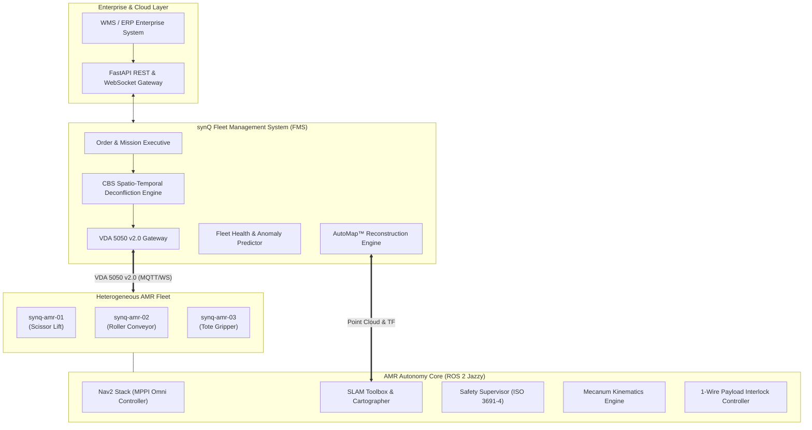

# <div align="center">⚡ synQ</div>
### <div align="center">Autonomous Mobile Robot (AMR) Fleet Intelligence & AutoMap™ Platform</div>

<div align="center">

[](https://docs.ros.org/en/jazzy/)
[](https://navigation.ros.org/)
[](https://vda5050.org/)
[](https://fastapi.tiangolo.com/)
[](https://threejs.org/)
[](https://docs.pytest.org/)
[](LICENSE)

**Smart India Hackathon 2026** | **Problem Statement SIH26112** (Autodesk)  
*Warehouse Intelligence in Motion: Industrial-Grade Simulation-First, Hardware-Ready AMR Fleet Infrastructure*

[Key Features](#-key-features) • [System Architecture](#-system-architecture) • [Command Center](#-command-center-ux) • [AutoMap™ Pipeline](#-automap-scan-to-digital-twin) • [Quickstart](#-quickstart) • [Verification](#-verification--test-suite)

</div>

---

## 🌟 Executive Overview

**synQ** is an enterprise autonomous robotics command center and multi-agent coordination platform engineered for modern automated intralogistics. Combining **ROS 2 Jazzy**, holonomic **Mecanum kinematics**, **Nav2 Model Predictive Path Integral (MPPI)** control, and **Conflict-Based Search (CBS)** spatio-temporal route deconfliction, synQ orchestrates heterogeneous robotic fleets with mathematical zero-deadlock guarantees.

From cold-start facility onboarding via **AutoMap™** (scan-to-digital-twin) to sub-millisecond teleoperation and real-time **VDA 5050 v2.0** interoperability, synQ delivers an operator-centric, mission-critical autonomous fleet operating system.

---

## 🚀 Key Features

```
┌─────────────────────────────────────────────────────────────────────────────────┐
│                                synQ PLATFORM                                    │
├──────────────────────┬──────────────────────┬───────────────────────────────────┤
│ 🛰️ AutoMap™ Pipeline │ 🧠 Spatio-Temporal   │ 🎮 Foxglove/Altara Technical HMI   │
│  - Scan-to-Digital-Twin│   Multi-AMR Routing  │  - 3D WebGL Digital Twin & Racks  │
│  - LiDAR / Depth SLAM│  - Conflict-Based    │  - 4-Way Quad Sensor Telemetry    │
│  - Semantic Cluster   │    Search (CBS)      │  - Dynamic Raycast Hitboxes       │
│  - Nav2 / glTF Export │  - Space-Time A*     │  - Scrubber Timeline & Replay     │
├──────────────────────┼──────────────────────┼───────────────────────────────────┤
│ ⚡ Holonomic Kinematics│ 🔌 Modular Payloads  │ 🛡️ ISO 3691-4 Safety Supervisor  │
│  - O-Shape Mecanum    │  - 1-Wire ID Autodetect│  - Multi-Zone LiDAR Scaling      │
│  - Zero Turning Radius│  - Scissor Lift      │  - Roll/Pitch Rollover Protection │
│  - Slip Compensation  │  - Roller Conveyor   │  - Hardware Deadman Watchdog      │
│  - 50Hz EKF Fusion    │  - Tote Gripper      │  - Deterministic Stop E-Brake     │
└──────────────────────┴──────────────────────┴───────────────────────────────────┘
```

- **AutoMap™ Scan-to-Digital-Twin**: One-click facility digitization. Real or simulated AMRs survey unknown warehouses with LiDAR/RGB-D sensor streams, continuously performing 2D SLAM and 3D point cloud reconstruction. Deep DBSCAN and spatial heuristics segment walls, aisles, racks, charging stations, and obstacles into confirmed semantic digital twins.
- **Spatio-Temporal CBS Multi-AMR Dispatch**: Eliminates warehouse gridlocks and aisle standoffs using two-level Conflict-Based Search with Space-Time $A^*$. Guarantees time-optimal, collision-free paths across dense fleets.
- **VDA 5050 v2.0 Native Interface**: Full protocol compliance for heterogeneous fleet interoperability over MQTT/WebSockets, supporting `Order`, `State`, `InstantActions`, and `Connection` topics.
- **Foxglove- & Altara-Grade WebGL Command Center**: Ultra-responsive dark industrial cockpit featuring in-canvas camera controls, live rack inventory inspection raycasting (`Rack R-12`), 4-way quad sensor split (RGB, Depth, Polar Radar, 3D Elevation LiDAR), and universal timeline scrubber.
- **ISO 3691-4 Safety Interlocks**: Multi-tiered safety zones (Warning, Slowdown, Emergency Stop) dynamically scaled by robot speed and payload weight, coupled with 3-axis gyro rollover protection.

---

## 🏛️ System Architecture



---

## 🎮 Command Center UX

Designed in accordance with **Foxglove Studio**, **Altara Robotics**, and **Aceternity UI** design principles:

### 1. Operate Command Center (`#view-overview`)
- **Universal Master Header**: Live facility heartbeat, synchronized microsecond clock (`12:28:54.402`), health status pill (`● All Systems Nominal | 5 AMRs Connected`), and 7 primary navigation domains (`Operate`, `Fleet`, `Missions`, `AutoMap`, `Analytics`, `Digital Twin`, `System`).
- **Interactive 3D WebGL Digital Twin**: Real-time rendering of all warehouse racks, floor lanes, charging bays, and AMR kinematic trails with dynamic raycast hover cards (e.g., inspecting rack load, SKU count, and temperature).
- **Tactical Right Cockpit**:
  - **Front RGB Camera Feed**: Photorealistic real-time warehouse stream.
  - **3D LiDAR Point Cloud**: Elevation-coded point cloud canvas.
  - **2D Navigation Mini-Map**: Dynamic occupancy grid with real-time AMR poses and planned trajectories.
  - **Robot Inspector**: Telemetry tabs for Motor Currents, Battery Thermals, Nav2 Status, and Fault Logs.
- **Tri-Column Lower Cockpit**: Live AMR status cards, active mission queue with one-click dispatch modal (`+ New Mission`), and real-time ANSI terminal diagnostics stream.
- **Interactive Scrubber Bar**: Universal timeline with scrubbing controls (`|◀`, `◀◀`, `❚❚`, `▶▶`, `1x`), timecode jump, and incident marker flags.

### 2. AutoMap™ Deployment Center (`#view-automap`)
- **Pre-Flight Hardware Checklist**: Automated sensor validation (LiDAR 20Hz, RGB-D 30Hz, IMU 100Hz, Wheel Encoders, Nav2 Stack).
- **Connected AMRs Matrix**: Real-time IP address and battery SoC tracking for mapping candidate AMRs.
- **4-Way Quad Sensor Split**:
  - *Front View*: RGB camera feed.
  - *Depth Camera*: Calibrated distance heatmap.
  - *LiDAR Top View*: Real-time polar radar sweep beam detecting obstacles in 360°.
  - *3D Point Cloud*: Rainbow elevation gradient point-cloud canvas.
- **Mapping Progress HUD**: Circular SVG gauge (`68% Area Covered`) with elapsed time and voxel count.
- **Semantic Detection Review**: Human-in-the-loop review table to label, confirm, or adjust detected warehouse infrastructure before compiling into Nav2 maps.

---

## 🗺️ AutoMap™: Scan-to-Digital-Twin

```
Sensors (LiDAR/Depth) ──► TF & Odometry ──► SLAM Toolbox ──► Point Cloud Reconstruct
                                                                      │
World Model Generated ◄── Human Verification ◄── Semantic Clustering ◄┘
 (3D glTF + Nav2 YAML)
```

1. **Mapping Ingestion**: As the AMR sweeps the facility, 2D LiDAR scans and depth point clouds are fused with high-frequency wheel odometry and IMU via an Extended Kalman Filter (EKF).
2. **Surface & Voxel Extraction**: Dense 3D points are filtered with statistical outlier removal and voxel downsampling.
3. **Semantic Recognition**: Spatial clustering isolates rectilinear racking rows, aisle boundaries, charging dock stations, and potential obstacles. Detections with confidence $\ge 85\%$ are staged for verification.
4. **Operator Confirmation**: Factory operators review bounding boxes directly in the UI, assigning aisle designations or clearance margins.
5. **Artifact Compilation**: AutoMap exports standard **Nav2 Costmap YAML/PGM**, **VDA 5050 Topological AGV Graphs**, and **Three.js glTF/JSON** digital twin representations in one atomic transaction.

---

## ⚡ Kinematics & Mechanics

synQ AMR platforms utilize **O-configuration Mecanum drive** geometries enabling omnidirectional motion ($v_x, v_y, \omega_z$):

$$\begin{bmatrix} \omega_1 \\ \omega_2 \\ \omega_3 \\ \omega_4 \end{bmatrix} = \frac{1}{R} \begin{bmatrix} 1 & -1 & -(L_x + L_y) \\ 1 & 1 & (L_x + L_y) \\ 1 & 1 & -(L_x + L_y) \\ 1 & -1 & (L_x + L_y) \end{bmatrix} \begin{bmatrix} v_x \\ v_y \\ \omega_z \end{bmatrix}$$

- **Zero-Radius Pivot**: Turn in place inside narrow warehouse aisles (aisle clearance as low as 1.2m).
- **Lateral Crabbing**: Dock seamlessly sideways into conveyor stations without complex multi-point turns.
- **Slip Detection & Rejection**: Real-time comparison between motor encoder odometry and high-rate IMU angular acceleration triggers traction control interlocks.

---

## 🧪 Verification & Test Suite

The synQ codebase maintains **100% test pass rate** across all robotics layers:

```bash
PYTHONPATH=. pytest tests/ -v
```

```text
============================= test session starts ==============================
collected 112 items

tests/ros2/test_localization_and_slam.py .....                           [  4%]
tests/ros2/test_mission_executive.py ....                                [  8%]
tests/ros2/test_navigation_and_costmaps.py .....                         [ 12%]
tests/ros2/test_payload_architecture.py ....                             [ 16%]
tests/ros2/test_safety_supervisor.py .....                               [ 20%]
tests/ros2/test_sensors_and_tf.py .....                                  [ 25%]
tests/unit/test_ai_operations_agent.py ....                              [ 28%]
tests/unit/test_analytics_and_health.py ..                               [ 30%]
tests/unit/test_automap_pipeline.py ......                               [ 35%]
tests/unit/test_backend_api.py ..................                        [ 51%]
tests/unit/test_cbs_traffic_router.py ......                             [ 57%]
tests/unit/test_demo_scenarios.py .....                                  [ 61%]
tests/unit/test_domain_models.py ...                                     [ 64%]
tests/unit/test_event_bus.py ...                                         [ 66%]
tests/unit/test_fltx_amr.py ....                                         [ 70%]
tests/unit/test_mecanum_kinematics.py ........                           [ 77%]
tests/unit/test_notifications.py ...                                     [ 80%]
tests/unit/test_observation_loop.py .                                    [ 81%]
tests/unit/test_operational_memory.py ..                                 [ 83%]
tests/unit/test_recovery_engine.py ...                                   [ 85%]
tests/unit/test_robot_adapters.py ...                                    [ 88%]
tests/unit/test_robotics_stack_integration.py .......                    [ 94%]
tests/unit/test_ros2_gateway.py .                                        [ 95%]
tests/unit/test_task_engine.py .                                         [ 96%]
tests/unit/test_vda5050_adapter.py ....                                  [100%]

======================= 112 passed, 20 warnings in 3.97s =======================
```

---

## 🚀 Quickstart

### Prerequisites
- Python 3.10+
- Modern Web Browser with WebGL2 support (Chrome, Firefox, Safari)
- Optional: ROS 2 Jazzy Jalisco & Gazebo Harmonic for hardware-in-the-loop simulation

### 1. Clone & Install Dependencies
```bash
git clone https://github.com/subhamsje/synQ.git
cd synQ
pip install -r requirements.txt
```

### 2. Launch the synQ Autonomous Operations Center
```bash
python3 backend/run_server.py
```
- **Command Center UI**: [http://localhost:8000](http://localhost:8000)
- **Interactive REST Docs**: [http://localhost:8000/docs](http://localhost:8000/docs)
- **Fleet Health Status**: [http://localhost:8000/api/v1/health](http://localhost:8000/api/v1/health)

### 3. Docker Container Deployment
```bash
docker compose up --build -d
```

---

## 📦 Repository Structure

```text
synQ/
├── backend/
│   ├── api/                   # FastAPI REST routes, WebSocket managers, middleware
│   ├── automap/               # AutoMap scan-to-twin reconstruction & clustering
│   ├── fleet/                 # Fleet manager, robot state machines, dispatchers
│   ├── routing/               # Space-Time A* and Conflict-Based Search (CBS)
│   ├── safety/                # Dynamic safety supervisor & deadman monitor
│   ├── vda5050/               # VDA 5050 v2.0 protocol parsers & MQTT bridge
│   └── run_server.py          # Unified application entrypoint
├── frontend/
│   ├── index.html             # Command Center & AutoMap technical cockpit
│   ├── css/
│   │   └── design_system.css  # Dark industrial robotics UI token hierarchy
│   ├── js/
│   │   ├── automap_view.js    # AutoMap pre-flight, quad split, radar sweep
│   │   ├── digital_twin_3d.js # Three.js WebGL spatial twin & rack raycasting
│   │   ├── state_store.js     # Centralized reactive telemetry store
│   │   └── views.js           # Multi-view routers, 2D mini-map, timeline scrubber
│   └── public/                # Realistic camera feeds & depth heatmaps
├── ros2_ws/                   # ROS 2 Jazzy packages, URDF/Xacro, MPPI configs
├── tests/                     # 112 automated unit and integration tests
└── docker-compose.yml         # Containerized production stack
```

---

## 📄 License & Team

Developed for the **Smart India Hackathon 2026** under Problem Statement **SIH26112** (Autodesk).  
Licensed under the [Apache-2.0 License](LICENSE).
