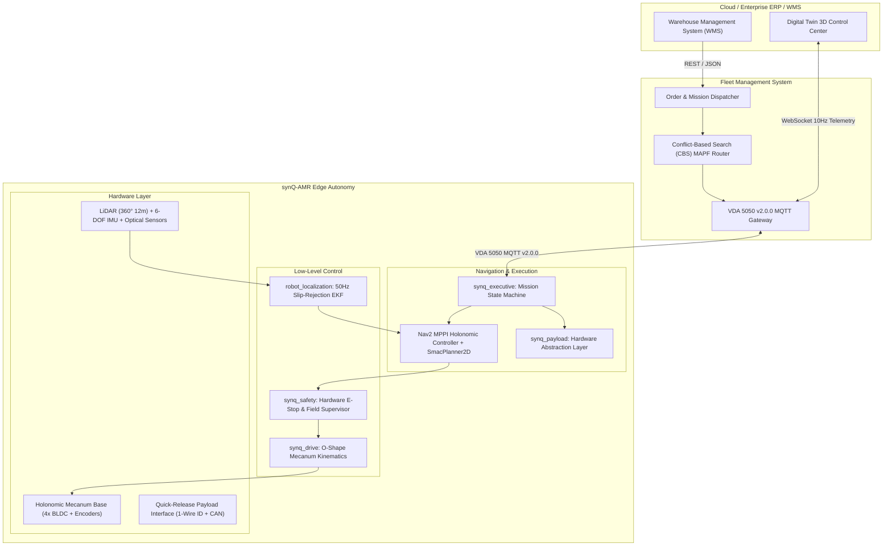

# synQ — Modular Autonomous Mobile Robot (AMR) Platform
## Comprehensive Technical Specifications & Architecture Blueprint
### SIH Problem Statement SIH26112 (Autodesk)

---

## 1. Executive Summary

**synQ** is a commercial-grade, modular autonomous mobile robot (AMR) ecosystem engineered for dynamic smart warehouse automation. It introduces a standardized mechanical, electrical, and software abstraction layer that decouples the holonomic base chassis from swappable application payloads (`SCISSOR_LIFT`, `ROLLER_CONVEYOR`, `TOTE_GRIPPER`). Autonomous coordination is powered by ROS 2 Jazzy, Nav2 Model Predictive Path Integral (MPPI) holonomic control, and an enterprise Fleet Management System (FMS) implementing Conflict-Based Search (CBS) and the VDA 5050 v2.0.0 protocol.

---

## 2. System Architecture Diagram

---

## 3. Physical & Kinematic Specifications

| Parameter | Specification | Engineering Justification |
| :--- | :--- | :--- |
| **Footprint Dimensions** | $700\,\text{mm} \times 500\,\text{mm} \times 280\,\text{mm}$ | Standard Euro-pallet sub-chassis clearance with tight aisle turning radius |
| **Gross Vehicle Mass** | $45.0\,\text{kg}$ (Unladen Chassis) | Optimal structural stiffness-to-weight ratio using 6061-T6 aluminum extrusion |
| **Max Payload Capacity** | $150.0\,\text{kg}$ | Accommodates heavy tote totes, cartons, and industrial tooling |
| **Drive Architecture** | 4-Wheel Independent Mecanum ($O$-shape) | True 3-DOF holonomic mobility: omnidirectional crabbing, diagonal translation |
| **Wheel Diameter ($D$)** | $152.4\,\text{mm}$ (6.0 in) | Minimizes rolling resistance over warehouse concrete expansion joints |
| **Max Linear Velocity ($v_x, v_y$)** | $1.5\,\text{m/s}$ (longitudinal), $1.0\,\text{m/s}$ (lateral) | Governed to match ISO 3691-4 industrial safety operational envelopes |
| **Max Angular Velocity ($\omega_z$)** | $2.0\,\text{rad/s}$ ($114.6^\circ/\text{s}$) | Fast point-turn orientation without longitudinal displacement |
| **Turning Radius** | $0.0\,\text{m}$ (Zero-radius turning) | In-place zero-radius turns reduce cycle time in narrow aisles |
| **Inscribed Radius ($r_{\text{inscribed}}$)** | $0.25\,\text{m}$ | Exact half-width of chassis for Nav2 inflation safety boundary |
| **Circumscribed Radius ($r_{\text{circum}}$)**| $0.4301\,\text{m}$ | Minimum circle enclosing all chassis corners |

---

## 4. Mecanum Kinematics Equations

For an $O$-shape Mecanum wheel geometry with track width $2L_y = 0.50\,\text{m}$ (half-track $L_y = 0.25\,\text{m}$), wheelbase $2L_x = 0.70\,\text{m}$ (half-wheelbase $L_x = 0.35\,\text{m}$), and wheel radius $R = 0.0762\,\text{m}$:

$$\begin{bmatrix} \omega_{FL} \\ \omega_{FR} \\ \omega_{RL} \\ \omega_{RR} \end{bmatrix} = \frac{1}{R} \begin{bmatrix} 1 & -1 & -(L_x + L_y) \\ 1 & 1 & (L_x + L_y) \\ 1 & 1 & -(L_x + L_y) \\ 1 & -1 & (L_x + L_y) \end{bmatrix} \begin{bmatrix} v_x \\ v_y \\ \omega_z \end{bmatrix}$$

---

## 5. Modular Payload Architecture

The platform supports hot/cold swapping of three core industrial payload modules via a standardized mechanical alignment dowel grid and 1-Wire DS2431 EEPROM digital identification:

1. **Scissor Lift Module (`SCISSOR_LIFT`)**:
   - Stroke: 0.0 to 0.80 m (0% to 100%).
   - Max load: 150 kg.
   - Hardware Safety Interlock: When height $> 5\%$, base transit velocity is hard-capped to $0.0\,\text{m/s}$.
2. **Powered Roller Conveyor Module (`ROLLER_CONVEYOR`)**:
   - Transfer speed: 0.1 to 0.6 m/s bidirectional.
   - Photoelectric optical crate detection sensor.
   - Hardware Safety Interlock: AMR motion is prohibited while roller motor is actively spinning.
3. **Parallel Tote Gripper Module (`TOTE_GRIPPER`)**:
   - Grip stroke: 200 mm to 600 mm.
   - Clamping force sensing: 0 to 200 N.
   - Automatic velocity throttling to 1.0 m/s when laden.

---

## 6. Multi-Agent Traffic Deconfliction (Conflict-Based Search)

To coordinate fleets of up to 50+ AMRs simultaneously without gridlock:
- **Low-Level Space-Time $A^*$**: Solves optimal time-expanded trajectories on the warehouse roadmap subject to vertex $(v, t)$ and edge $(u, v, t)$ constraint sets.
- **High-Level Constraint Tree (CT)**: Detects vertex collisions and edge swaps between any AMR pairs, dynamically branching constraints to achieve mathematically guaranteed conflict-free paths with minimal sum-of-costs.

---

## 7. Standardized Interfaces: VDA 5050 v2.0.0

Full conformance with the international VDA 5050 AGV/AMR standard over MQTT:
- `uagv/v2/synQ/{serialNumber}/order`: JSON order dispatch with node sequences and payload actions.
- `uagv/v2/synQ/{serialNumber}/state`: 1Hz JSON telemetry broadcast (pose, battery, errors, operatingMode).
- `uagv/v2/synQ/{serialNumber}/instantActions`: Instantaneous `instantStop`, `pauseOrder`, and `cancelOrder`.
